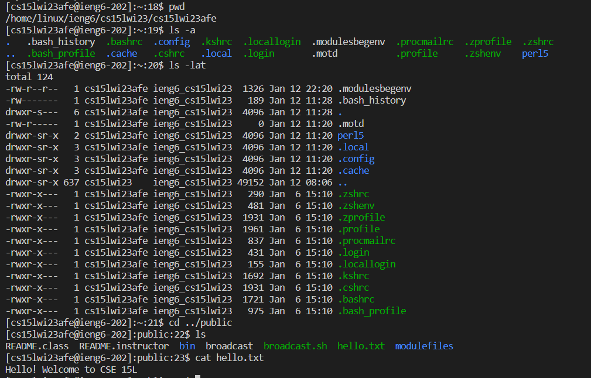

# Week 1 Lab Report
&nbsp;
&nbsp;

## Step 1: Open Visual Studio Code

&nbsp;
* Install Visual Studio Code if not already installed on device
* Open Visual Studio Code
* `Ctrl+Shift+N` or `file->New Window` in order to open a new window

&nbsp;
&nbsp;
---
## Step 2: Open Terminal and Connect Remotely

&nbsp;
* `Ctrl+Shift+'` or `Terminal->New Terminal` in order to open a new terminal
* Type in `ssh` command replacing `zzz` with your specific account
```
ssh cs15lwi23zzz@ieng6.ucsd.edu
```
* Type in your password associated with your account (What you type will not show for security)

&nbsp;
&nbsp;
---
## Step 3: Run Some Basic Commands in Terminal

&nbsp;
* Run some basic commands by typing it in the terminal
* Examples of commands include: `cd` `ls` `pwd` `cat`
* `Ctrl+D` or type `exit` into terminal to leave the remote server
