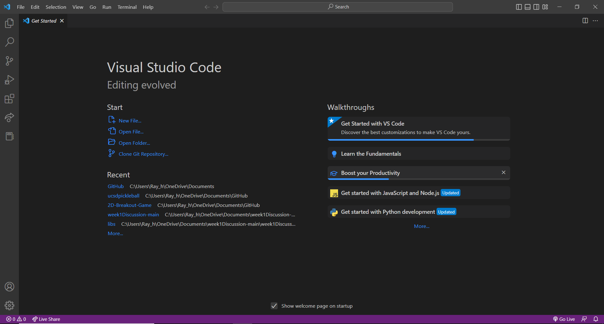
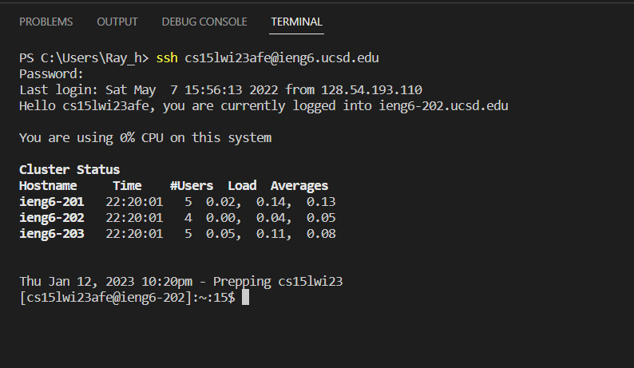

# Week 1 Lab Report
&nbsp;
&nbsp;

## Step 1: Open Visual Studio Code

&nbsp;
* Install [Visual Studio Code](https://code.visualstudio.com/download) if not already installed on device.
* Open Visual Studio Code.
* `Ctrl+Shift+N` or `file->New Window` in order to open a new window.

&nbsp;
&nbsp;
---
## Step 2: Open Terminal and Connect Remotely

&nbsp;
* `Ctrl+Shift+'` or `Terminal->New Terminal` in order to open a new terminal.
* Find your course specfic account for CSE15L found [here](https://sdacs.ucsd.edu/~icc/index.php). Your account ID will be in a button and look like `cs15lwi23zzz`.
* Change your password if needed with [this tutorial](https://docs.google.com/document/d/1hs7CyQeh-MdUfM9uv99i8tqfneos6Y8bDU0uhn1wqho/edit).
* Type in `ssh` command replacing `zzz` with your specific account.
```
ssh cs15lwi23zzz@ieng6.ucsd.edu
```
* Type in your password associated with your account (What you type will not show for security).

&nbsp;
&nbsp;
---
## Step 3: Run Some Basic Commands in Terminal

&nbsp;
* Run some basic commands by typing it in the terminal.
* Examples of commands include: `cd` `ls` `pwd` `cat`.
* You are able to get a lot of information by running different commands. For example, `ls -a` will list out all the diffent items in the current directory while `ls -lat` will do the same, but give detailed information about each item as seen above. Furthermore, you can use `cd` and `pwd` in order to traverse the system easily and get to different files and folders.
* `Ctrl+D` or type `exit` into terminal to leave the remote server.
