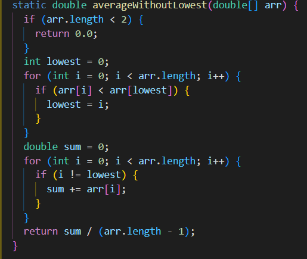

# Lab Report 2
&nbsp;
&nbsp;

## Part 1
### StringServer Code:

### Screenshot 1

* The main method and the handleRequest methods are called.
* The argument in main is the args string which contains the number 4000 for the port of the server. Within the handleRequest method, the url argument contains the url at the top of the screenshot which is `localhost:4000/add-message?s=Week 3`.
* The two values that get changed are the url and store variables. The url gets a new url value as shown above. The store string gets a new substring added onto it. In this case, `Week 3` is added onto the string.

### Screenshot 2

* The main method and the handleRequest methods are called.
* The argument in main is the args string which contains the number 4000 for the port of the server. Within the handleRequest method, the url argument contains the url at the top of the screenshot which is `localhost:4000/add-message?s=Lab Report`.
* The two values that get changed are the url and store variables. The url gets a new url value as shown above. The store string gets a new substring added onto it. In this case, `Lab Report` is added onto the string which results in a final string of `Week 3\n Lab Report`.

---

## Part 2
    //Failure-inducing input
    @Test
    public void testAverageWithoutLowest() {
        double[] input1 = { 10, 10, 40, 30 };
        assertEquals((30.0 + 10.0 + 40.0) / 3.0, ArrayExamples.averageWithoutLowest(input1), 0);
    }

    //Not a failure-inducing input
    @Test
    public void testAverageWithoutLowest1() {
        double[] input1 = { 10, 20, 30, 30, 40 };
        assertEquals(30.0, ArrayExamples.averageWithoutLowest(input1), 0);
    }
### Symptom

### Before

### After

---

## Part 3
One of the things I learned from week 2 of lab is that you can use url's path and query to do different operations. For example, you are able to get information from the query in order to perform another operation. In this way, I can create programs using just information from the url which opens up many other possibilites. One thing I learned in week 3 that I didn't know before was the idea of making many tests in order to find bugs within the program. I have run tests before, but have never done it like I did in the lab.
