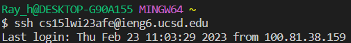
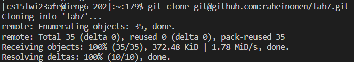
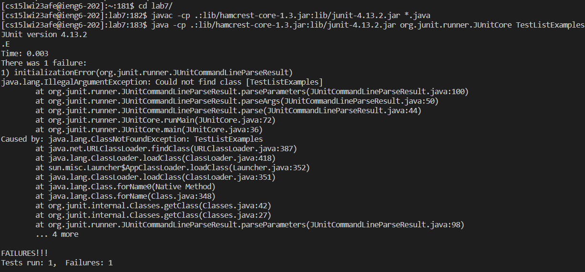
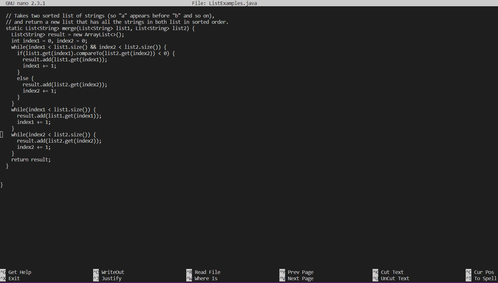
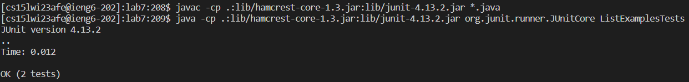
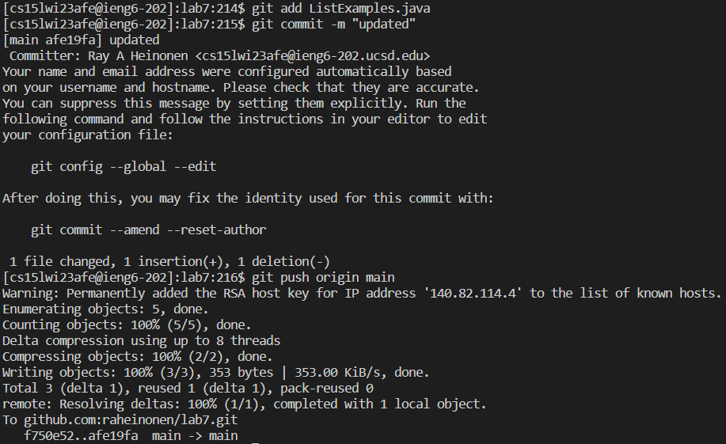

# Lab Report 4

## 1.

Key Pressed: `<up>``<up>``<up>``<enter>`
The `ssh cs15lwi23afe@ieng6.ucsd.edu` command to log into my ieng6 account was 3 up in the history, so I used up arrows to find it.

---
## 2.

Kep Pressed: git clone `<ctrl+v>``<enter>`
The ssh key for the clone of the git repository was copied in my clipboard. So in order to clone it, I typed out git clone and pasted the ssh key.

---
## 3.

Key Pressed: cd l`<tab>``<enter>`, `<up>``<up>``<up>``<up>``<up>``<up>``<enter>`, `<up>``<up>``<up>``<up>``<up>``<up>``<enter>`
I first had to change the direcotry to the repository so I autocompleted `lab7/` when using the command. My `javac -cp .:lib/hamcrest-core-1.3.jar:lib/junit-4.13.2.jar *.java` command and `java -cp .:lib/hamcrest-core-1.3.jar:lib/junit-4.13.2.jar org.junit.runner.JUnitCore TestListExamples` command were both 6 spaces up in the history, so I used up keys to access them.

---
## 4.

Key Pressed: nano L`<tab>`.java`<enter>`, 42x`<down>` 12x`<right>` `<delete>`2 `<ctrl+o>``<enter>``<ctrl+x>`
I used nano in order to edit the `ListExamples.java` file. Using arrows key to get to the location and editing. I pressed `ctrl+o` and `ctrl+x` in order to save and exit from the nano with the edited file.

---
## 5.

Key Pressed: `<up>``<up>``<up>``<enter>`, `<up>``<up>``<up>``<enter>`
I re-ran the files in order to test that they passed. I pressed up keys 3 times each in order to get the `javac -cp .:lib/hamcrest-core-1.3.jar:lib/junit-4.13.2.jar *.java` command and `java -cp .:lib/hamcrest-core-1.3.jar:lib/junit-4.13.2.jar org.junit.runner.JUnitCore TestListExamples` command from the history.

---
## 6.

Key Pressed: git add L`<tab>`.java`<enter>`, git commit -m "updated"`<enter>`, git push o`<tab>` m`<tab>``<enter>`
I added the `ListExamples.java` onto the stage ready to be committed. I then committed the changes with the commit command. I finally pushed it back to the repository on github by autocompleting to `origin` and `main`.
