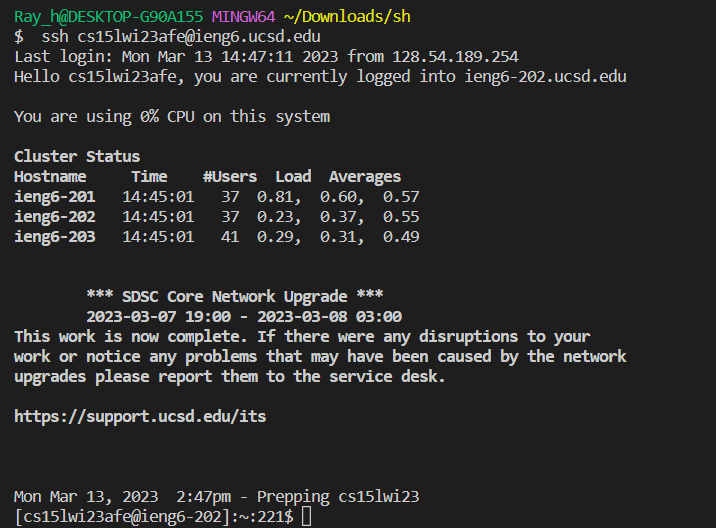
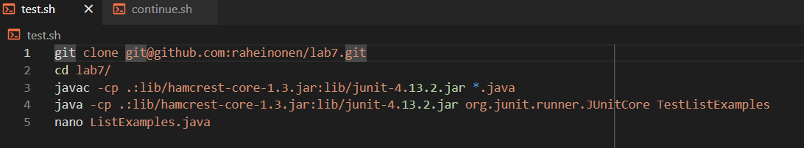
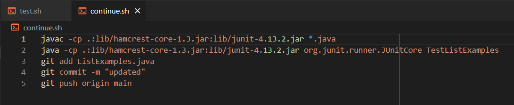

# Lab Report 5

Lab report 4 involved tasks that we had to do quickly to practice running commands in the terminal. You were not allowed to use a bash scripts to complete the tasks. However, if using bash scripts were allowed, it would have been possible to completet the commands even faster. This is because you can run terminal commands through bash scripts just like you would by typing it out in the terminal.

---

## 1.

* First step is to log into the remote server by going into history using up arrows to find `ssh cs15lwi23afe@ieng6.ucsd.edu` command and press `<enter>`. This brings you into the remote server that should already contain the bash scripts for running the other commands.

---

## 2.

* You will now run the `test.sh` file by tying in `sh test.sh`. This will run the necessary commands of cloning and running the files. It will also boot up the nano editing

---

## 3.

* Then use nano in order to edit the `ListExamples.java` file. The previous sh script should have already opened the nano editing section.
* Using arrows key to get to the location and editing. I pressed `ctrl+o` and `ctrl+x` in order to save and exit from the nano with the edited file.

---

## 4.

* After exiting nano, you first enter `sh ../continue.sh` in order to run the next sh script. The `../` is necessary because the sh script is inside the main directory while you are currently in the `lab7/` directory. 
* The sh script completes the rest of the commands including running the file, commiting the file, and pushing the file to github.

---

With the use of bash script, it is much easier and faster to run all the commands/tasks. I was able to finish all tasks in about 20 seconds when it took me over 2 mintues when doing the tasks without the bash scripts.
